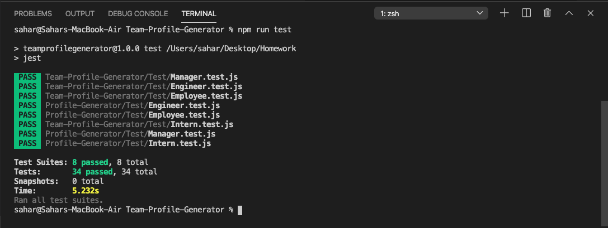
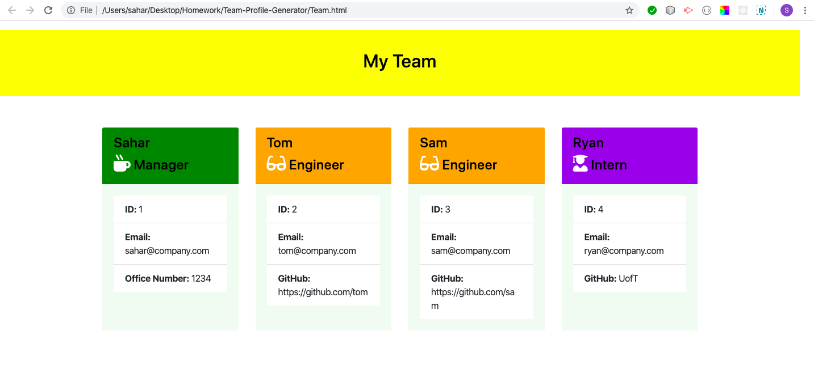

# TeamProfileGenerator


## User Story

```
As a manager
I want to generate a webpage that displays my team's basic info
so that I have quick access to emails and GitHub profiles
```
## Test

The dependencies are, [jest](https://jestjs.io/) for running the provided tests, and [inquirer](https://www.npmjs.com/package/inquirer) for collecting input from the user.


 ## Results Screenshots:






### Classes
The project have these classes: `Employee`, `Manager`, `Engineer`, `Intern`. 
The tests for these classes in the `tests` directory must all pass.

The first class is an `Employee` parent class with the following properties and
methods:

  * name
  * id
  * title
  * getName()
  * getId()
  * getEmail()
  * getRole() // Returns 'Employee'

The other three classes will extend `Employee`. 

In addition to `Employee`'s properties and methods, `Manager` will also have:

  * officeNumber

  * getRole() // Overridden to return 'Manager'

In addition to `Employee`'s properties and methods, `Engineer` will also have:

  * github  // GitHub username

  * getGithub()

  * getRole() // Overridden to return 'Engineer'

In addition to `Employee`'s properties and methods, `Intern` will also have:

  * school 

  * getSchool()

  * getRole() // Overridden to return 'Intern'

